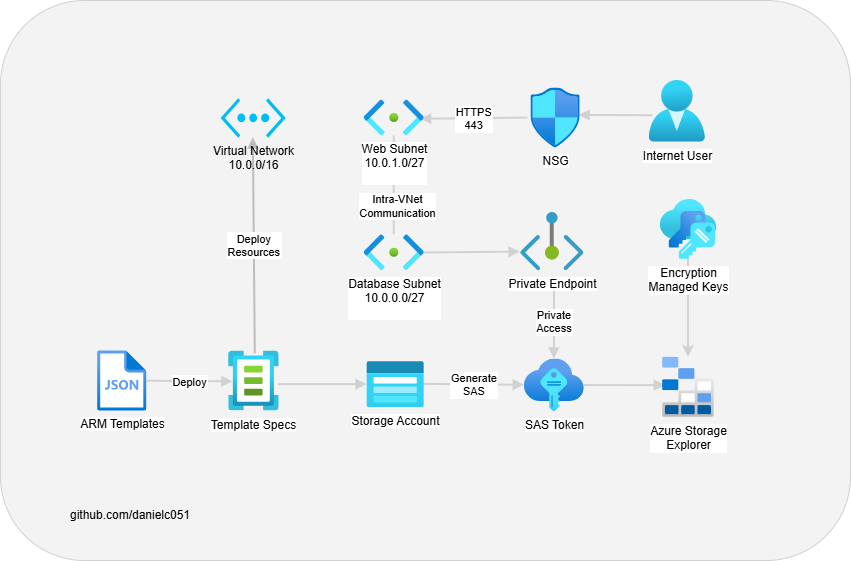

# 🌐 Azure Networking and Storage Project

---

## 📘 Scenario

A company wants to deploy a secure storage account, ensure network isolation for its resources, enforce data encryption, and use templates to automate the deployment of resources.

---



# 🛠️ Steps

---

## 1️⃣ 🌐 Create a Virtual Network (VNet)

- Go to:
  - **Azure Portal** > **Virtual Networks** > **Create**

- Add two subnets:
  - **Web**
  - **Database**

### 🗄️ Database Subnet

- `+ Subnet`
- Configure:
  - Name: `Database`
  - IPv4: `10.0.0.0`
  - Size: `/27`
  - Enable:
    - ✅ Private subnet
    - ✅ Service Endpoints for `Microsoft.Storage`

### 🌍 Web Subnet

- `+ Add a Subnet`
- Configure:
  - Name: `Web`
  - IPv4: `10.0.1.0`
  - Size: `/27`

- Review and create.

### 🔗 VNet Communication

- Azure automatically enables:
  - **Intra-VNet communication**
- Subnets in the same VNet can communicate directly by default.

---

## 2️⃣ 🔒 Deploy a Network Security Group (NSG)

- Navigate to:
  - **Network Security Groups** > **Create**

- Associate the NSG with the:
  - **Web subnet**

### 🔗 Associate NSG

- Go to:
  - Resource > Subnets > Associate > `Web`

### 📥 Add Inbound Rules

#### ✅ Allow HTTPS (443)

- Go to:
  - Inbound security rules > Add
- Configure:
  - Destination port: `443`
  - Service: `HTTPS`
- Add rule.

#### ❌ Block All Other Internet Traffic

- Add another rule:
  - Destination port: `*`

### 💡 Notes

- If SSH/RDP is needed:
  - Add higher-priority allow rules.

- Default NSG rules cannot be modified:
  - `AllowVnetInBound`
  - `AllowAzureLoadBalancerInBound`
  - `DenyAllInBound`

- You can override defaults using higher-priority rules.

---

## 3️⃣ 💾 Create and Configure a Storage Account

- Navigate to:
  - **Storage Accounts** > **Create**

### 🔁 Replication

Choose either:

- **LRS** — Locally Redundant Storage
- **GRS** — Geo-Redundant Storage

### 🔐 Private Endpoint

Ensure secure access from the database subnet.

#### Configure

- Go to:
  - Advanced
  - Permitted scope
  - “From storage accounts that have a private endpoint…”

- Disable:
  - ❌ Public access

- Add:
  - ✅ Private Endpoint
  - Select the `Database` subnet

### 🔑 Encryption

- Use:
  - **Microsoft-managed keys**

---

## 4️⃣ 📦 Deploy Using ARM Templates

### 📥 Export Templates

For both:

- VNet
- Storage Account

Go to:

- Automation > Export Template > Download

### 📤 Import Templates

Navigate to:

- **Template Specs**
  - Import template
  - Select:
    - `template.json`

- Create template spec.

### 🚀 Deploy Template

- In Template Specs:
  - Click the `⋮` (three dots)
  - Select:
    - **Deploy**

---

## 5️⃣ 🧪 Test Access and Encryption

### 🔑 Generate a SAS Token

Navigate to:

- Storage Accounts
- Your storage account
- Security + Networking
- Shared Access Signature

### Configure

- Select:
  - ✅ All allowed resource types

- Click:
  - **Generate SAS**

---

## 📂 Test Blob Service SAS URL

### 🗃️ Use Azure Storage Explorer

- Download and install:
  - Azure Storage Explorer

- Go to:
  - **Connect to Azure Resources**
  - **Use a shared access signature (SAS) URI**

- Paste:
  - Connection String

### ✅ Test Upload/Download

- Create a blob container
- Upload/download files

---

## ⚡ Use AzCopy

### 📥 Install AzCopy

- Download AzCopy

### ▶️ Run Test Upload

```bash
azcopy copy "file-to-upload.txt" "https://proj2saqwerty.blob.core.windows.net/container-name/file-to-upload.txt?[SAS]"
```

### 📝 Note

Replace:

```text
[SAS]
```

with your generated SAS token.